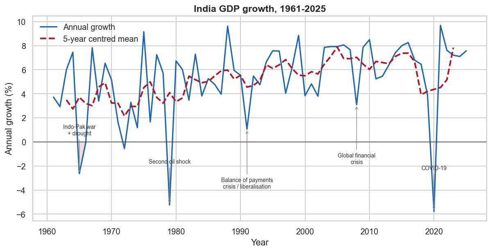
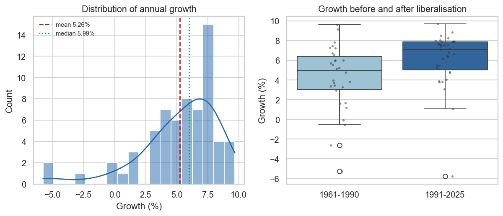
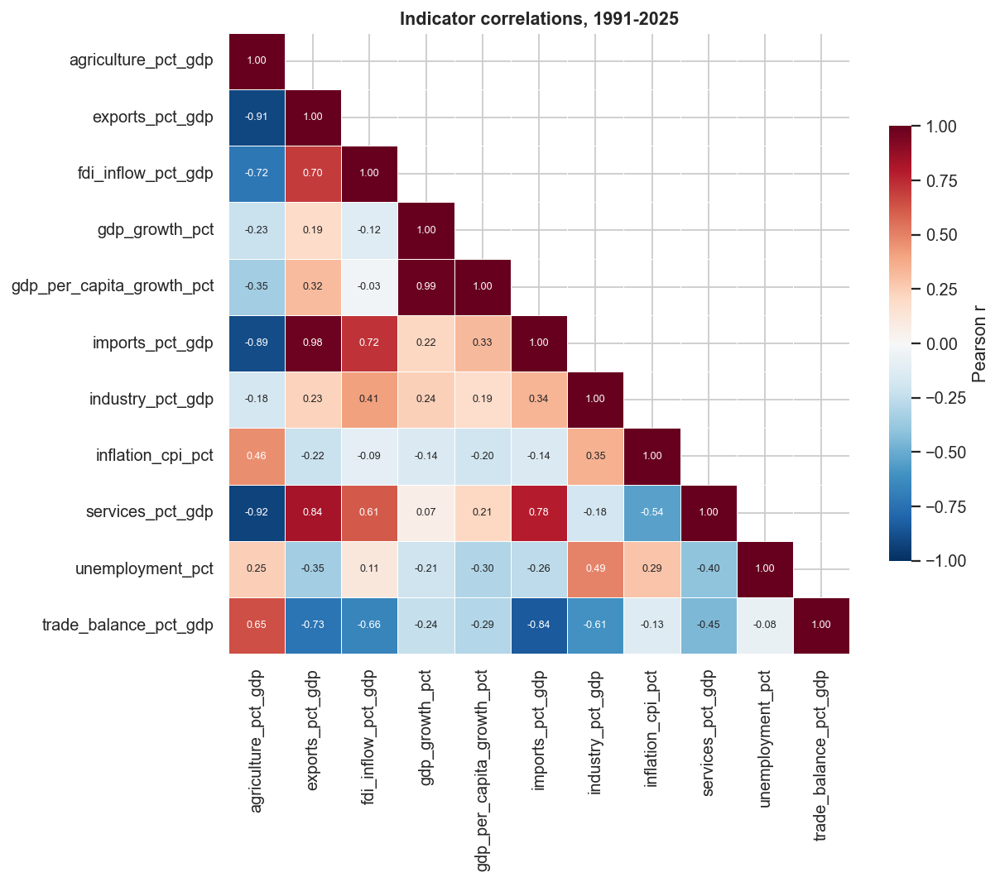
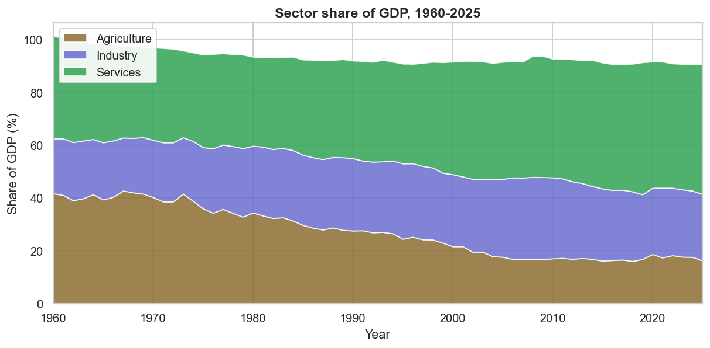
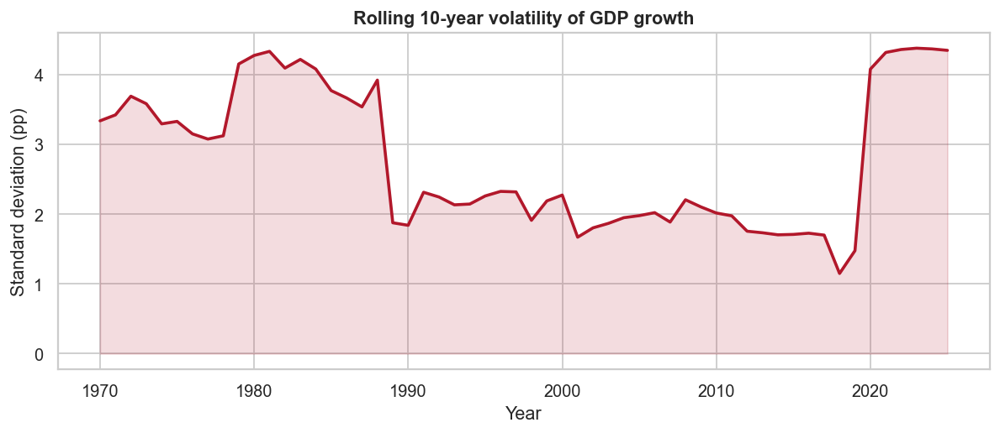

# Exploratory Data Analysis

All figures are generated by `src/eda.py` and saved to `reports/figures/`.

## 1. Summary statistics

|                           |   count |   mean |   std |   min |   median |   max |
|:--------------------------|--------:|-------:|------:|------:|---------:|------:|
| agriculture_pct_gdp       |      66 |  27.3  |  9.31 | 16.03 |    26.98 | 42.75 |
| exports_pct_gdp           |      66 |  11.76 |  7.45 |  3.31 |     9.34 | 25.43 |
| fdi_inflow_pct_gdp        |      56 |   0.8  |  0.87 | -0.03 |     0.61 |  3.62 |
| gdp_growth_pct            |      65 |   5.26 |  3.19 | -5.78 |     5.99 |  9.69 |
| gdp_per_capita_growth_pct |      65 |   3.32 |  3.31 | -7.42 |     3.76 |  8.79 |
| imports_pct_gdp           |      66 |  13.64 |  8.44 |  3.71 |     9.7  | 31.26 |
| industry_pct_gdp          |      66 |  25.87 |  2.89 | 20.09 |    26.48 | 31.14 |
| inflation_cpi_pct         |      66 |   7.23 |  4.81 | -7.63 |     6.53 | 28.6  |
| services_pct_gdp          |      66 |  40.4  |  5.22 | 32.95 |    38.21 | 50.08 |
| unemployment_pct          |      35 |   7.18 |  1.07 |  4.17 |     7.61 |  7.86 |
| trade_balance_pct_gdp     |      66 |  -1.88 |  1.5  | -6.72 |    -1.7  |  0.57 |

## 2. Growth over time

Mean annual growth across 65 years is **5.26%** with a standard deviation of 3.19 percentage points. The series ranges from -5.78% (2020) to 9.69% (2021).

## 3. The 1991 break

| Era | Years | Mean growth | Volatility |
|---|---|---|---|
| 1961-1990 | 30 | 4.23% | 3.36 |
| 1991-2025 | 35 | 6.14% | 2.80 |

Average growth after liberalisation is **+1.91 percentage points** higher, and the spread is narrower (2.80 vs 3.36). The pre-1991 economy did not just grow more slowly, it grew less predictably.

## 4. What moves with growth

Correlation with GDP growth, 1991-2025:

|                       |   correlation |
|:----------------------|--------------:|
| trade_balance_pct_gdp |        -0.241 |
| industry_pct_gdp      |         0.239 |
| agriculture_pct_gdp   |        -0.226 |
| imports_pct_gdp       |         0.216 |
| unemployment_pct      |        -0.21  |
| exports_pct_gdp       |         0.193 |
| inflation_cpi_pct     |        -0.141 |
| fdi_inflow_pct_gdp    |        -0.119 |
| services_pct_gdp      |         0.068 |

These are contemporaneous correlations, not predictive ones. A variable that moves with growth in the same year is not necessarily able to forecast it, which is why `src/forecast.py` uses lagged values only.

## 5. Structural change

The agriculture share of GDP fell from 41.7% in 1960 to 16.2% in 2025, while services rose from 38.8% to 49.3%. The industry share is broadly flat across the whole period, so the shift has been agriculture to services rather than the agriculture-to-industry path of most industrialising economies.

## 6. Volatility

## 7. Outlier years

|   year |   growth_pct | direction     |
|-------:|-------------:|:--------------|
|   1965 |        -2.64 | unusually low |
|   1979 |        -5.24 | unusually low |
|   2020 |        -5.78 | unusually low |

These years are shocks, not data errors, so they are kept in the dataset. They are the main reason a naive carry-forward forecast performs badly: it propagates a one-off shock into the prediction for the following year.